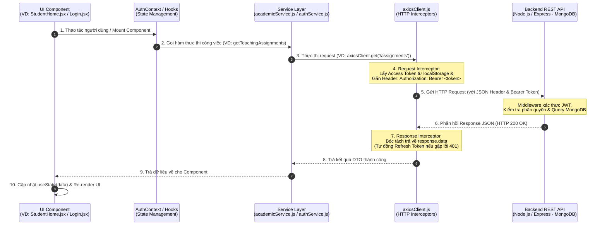

# 📐 Kiến Trúc & Sơ Đồ Nguyên Lý Hoạt Động Frontend (edulms-frontend)

Tài liệu mô tả tổng quan về kiến trúc luồng dữ liệu, nguyên lý kết nối giữa Frontend (`edulms-frontend`) với Backend API và quy trình xử lý hiển thị giao diện (UI Rendering).

---
## 📚 Các Thuật Ngữ Dùng Trong API Client
- baseURL	Địa chỉ gốc của Backend
- headers	Thông tin gửi kèm request
- token	"Chìa khóa" xác thực người dùng
- interceptor	Bộ phận tự động chặn và xử lý request/response
---

## 🌐 Sơ Đồ Nguyên Lý Hoạt Động Tổng Quan



---

## 🏗 Mô Hình Phân Lớp 4 Tầng (4-Layer Architecture)

```
+-------------------------------------------------------------------+
| 1. UI Layer (React Components / Pages / Layouts)                 |
|    - StudentHome.jsx, Login.jsx, RoleSidebarLayout.jsx...         |
+-------------------------------------------------------------------+
                                  │ (State & Events)
                                  ▼
+-------------------------------------------------------------------+
| 2. State & Context Layer (Global State & Custom Hooks)            |
|    - AuthContext.jsx (useAuth), React useState / useEffect        |
+-------------------------------------------------------------------+
                                  │ (Function Invocation)
                                  ▼
+-------------------------------------------------------------------+
| 3. Service Layer (API Encapsulation Services)                      |
|    - authService.js, academicService.js, userService.js...       |
+-------------------------------------------------------------------+
                                  │ (Axios Calls)
                                  ▼
+-------------------------------------------------------------------+
| 4. HTTP Client Layer (Centralized Axios Client & Interceptors)    |
|    - axiosClient.js (Bearer Token Injection & Auto Refresh 401)   |
+-------------------------------------------------------------------+
                                  │ (HTTPS / REST API)
                                  ▼
                    [ Backend Node.js / Express Server ]
```
---
1. UI (Giao diện)
        ↓
2. State & Context (Quản lý dữ liệu)
        ↓
3. Service (Gọi API theo chức năng)
        ↓
4. Axios Client (Cấu hình gửi request)
        ↓
5. Backend
---
Ex:
Login.jsx
   │
   │ Người dùng bấm Login
   ▼
AuthContext.jsx
   │
   │ login(email, password)
   ▼
authService.js
   │
   │ authService.login(data)
   ▼
axiosClient.js
   │
   │ POST /auth/login
   ▼
Backend Express
---

## 🔄 Chi Tiết Luồng Dữ Liệu Từ Request Đến UI

### Bước 1: Khởi tạo Component & Trigger Event
- Người dùng truy cập tuyến đường (VD: `/student`).
- Component `StudentHome.jsx` được mount, khởi tạo các local state: `const [assignments, setAssignments] = useState([])` và `const [loading, setLoading] = useState(true)`.
- `useEffect` kích hoạt hàm lấy dữ liệu.

### Bước 2: Gọi Hàm Service Nghiệp Vụ
- Component gọi hàm service tương ứng: `academicService.getTeachingAssignments()`.
- Lớp Service đóng vai trò trừu tượng hóa các endpoint API, giúp các UI component không cần viết đường dẫn URL thủ công.

### Bước 3: Gửi HTTP Request Qua `axiosClient`
- Service sử dụng `axiosClient.get('/academic/assignments')`.
- **Request Interceptor** hoạt động: Lấy `accessToken` từ `localStorage` và tự động gắn thêm header `Authorization: Bearer <token>`.

### Bước 4: Xử lý ở Backend & Nhận Phản hồi
- Server Express kiểm tra tính hợp lệ của Token qua Middleware.
- Truy vấn MongoDB và gửi trả response định dạng JSON: `{ success: true, data: [...] }`.

### Bước 5: Can Thiệp Của Response Interceptor
- Nếu kết quả trả về `200 OK`: `axiosClient` tự động bóc tách và trả về `response.data`.
- Nếu gặp lỗi `401 Unauthorized` (Token hết hạn): `axiosClient` ngầm gửi request `/auth/refresh` bằng Cookie Refresh Token để lấy Access Token mới, cập nhật `localStorage` và thực hiện gửi lại request ban đầu (Silent Auto-Retry).

### Bước 6: Cập Nhật State & Re-render Giao Diện
- Dữ liệu được trả về `StudentHome.jsx`.
- Component gọi `setAssignments(formattedData)` và `setLoading(false)`.
- React thực hiện Re-render giao diện hiển thị danh sách khóa học hoàn chỉnh cho học sinh.

---

## 📚 Các Tài Liệu Liên Quan
- 📡 [Hướng dẫn & Nguyên lý `axiosClient.js`](../src/api/README.md)
- 🔐 [Hướng dẫn & Nguyên lý `AuthContext.jsx`](../src/context/README.md)
