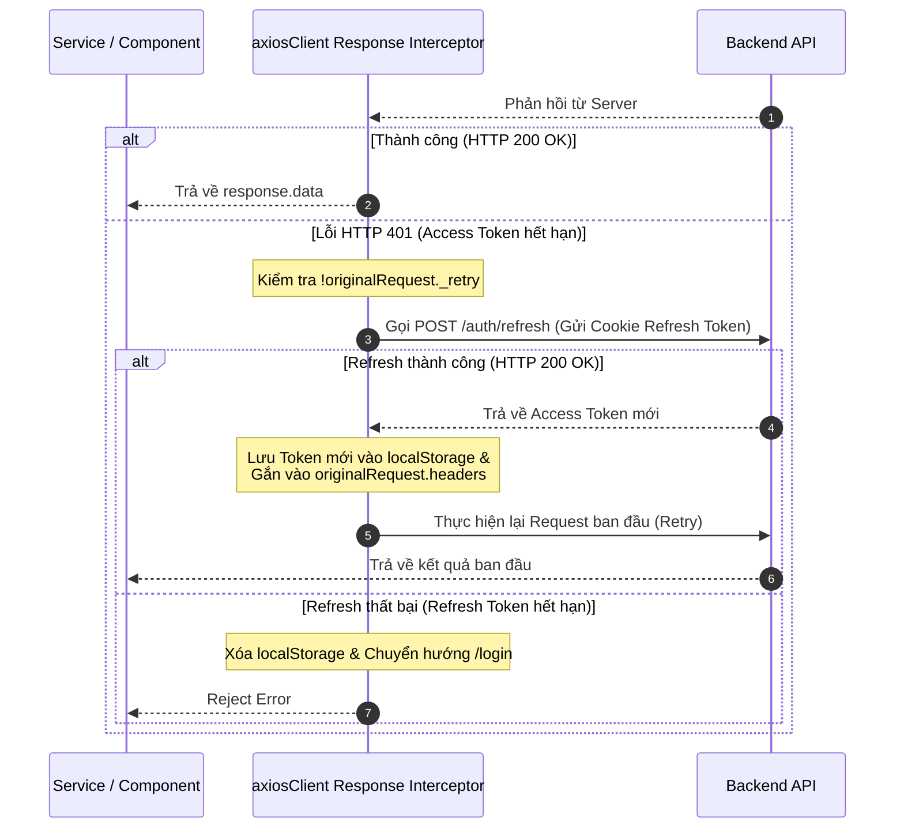

# 📡 Hướng Dẫn & Nguyên Lý Hoạt Động của `axiosClient.js`

Tệp [`src/api/axiosClient.js`](file:///g:/hcmute/TLCN/Edu-LMS/edulms-frontend/src/api/axiosClient.js) đóng vai trò là **Cổng kết nối HTTP trung tâm (Central HTTP Client)** cho toàn bộ ứng dụng Frontend EduLMS.

---

## 🛠 Cấu Hình Instance Ban Đầu

```javascript
const axiosClient = axios.create({
  baseURL: import.meta.env.VITE_API_URL || "http://localhost:5000/api/v1",
  headers: {
    "Content-Type": "application/json",
  },
  withCredentials: true, // Cho phép tự động gửi Cookie chứa Refresh Token
});
```

* **`baseURL`**: Tự động lấy từ biến môi trường `VITE_API_URL` (hoặc mặc định `http://localhost:5000/api/v1`).
* **`headers`**: Định dạng dữ liệu mặc định gửi lên Backend là JSON.
* **`withCredentials: true`**: Cho phép trình duyệt tự động đính kèm **HTTP-Only Cookie** (chứa Refresh Token) trong các request cross-domain.

---

## ⚙️ Nguyên Lý Hoạt Động của Interceptors

### 1. Request Interceptor (Gửi Access Token)

Trước khi bất kỳ request nào được gửi sang Backend, Request Interceptor sẽ chạy:

```javascript
axiosClient.interceptors.request.use((config) => {
  const token = localStorage.getItem("accessToken");
  if (token) {
    config.headers.Authorization = `Bearer ${token}`;
  }
  return config;
});
```

- **Mục đích**: Tự động lấy `accessToken` từ `localStorage` và đính kèm vào Header `Authorization: Bearer <token>`.
- **Lợi ích**: Giúp tất cả các Service (`authService`, `academicService`...) không cần phải tự thêm Header thủ công trong từng hàm API.

---

### 2. Response Interceptor (Xử Lý Dữ Liệu & Tự Động Refresh Token)

Response Interceptor xử lý dữ liệu trả về từ Backend hoặc can thiệp xử lý lỗi HTTP:



#### Chi tiết xử lý ngầm (Silent Refresh):
1. **Lỗi 401 Unauthorized**: Khi Access Token hết hạn, Backend trả về lỗi 401.
2. **Cờ `_retry`**: Đánh dấu `originalRequest._retry = true` để ngăn ngừa vòng lặp vô hạn nếu API refresh cũng lỗi.
3. **Lấy Token mới**: Gọi `axios.post('/auth/refresh')`. Nếu thành công, nhận Access Token mới và lưu vào `localStorage`.
4. **Retry Request gốc**: Gán Token mới vào Header của `originalRequest` và thực thi lại. Người dùng sẽ không nhận biết được là phiên vừa được gia hạn ngầm.
5. **Xử lý thất bại**: Nếu Refresh Token cũng hết hạn, hệ thống tự động xóa `localStorage` và chuyển hướng trình duyệt về trang `/login`.

---

## 💻 Hướng Dẫn Sử Dụng Trong Service

Khi viết một Service mới, chỉ cần import `axiosClient`:

```javascript
import axiosClient from "../api/axiosClient";

// GET Request
export const getCourses = async () => {
  return axiosClient.get("/courses"); // Nhận trực tiếp response.data
};

// POST Request
export const createSubmission = async (payload) => {
  return axiosClient.post("/submissions", payload);
};
```
