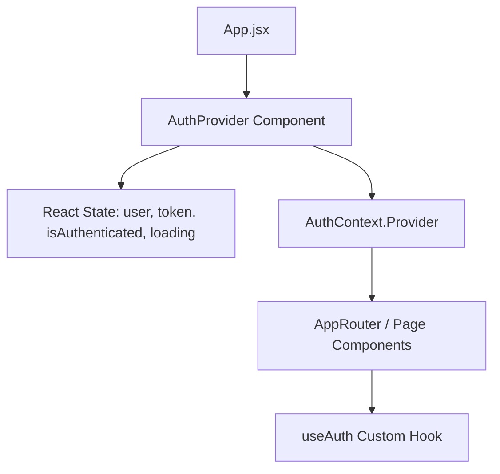

# 🔐 Hướng Dẫn & Nguyên Lý Hoạt Động của `AuthContext.jsx`

Tệp [`src/context/AuthContext.jsx`](file:///g:/hcmute/TLCN/Edu-LMS/edulms-frontend/src/context/AuthContext.jsx) là trung tâm quản lý **Trạng thái Xác thực (Authentication State Management)** cho toàn bộ ứng dụng Frontend EduLMS bằng React Context API & Custom Hook.

---

## 🏗 Kiến Trúc Cấu Trúc Thành Phần



---

## 🔑 4 Nguyên Lý Lõi Trong Mã Nguồn

### 1. Khởi Tạo Trạng Thái Lười (Lazy State Initialization)
Sử dụng hàm callback trong `useState` khi đọc `localStorage`:

```javascript
const [user, setUser] = useState(() => {
  try {
    const storedUser = localStorage.getItem("user");
    return storedUser ? JSON.parse(storedUser) : null;
  } catch {
    return null;
  }
});
const [token, setToken] = useState(() => localStorage.getItem("accessToken"));
const [isAuthenticated, setIsAuthenticated] = useState(() => !!localStorage.getItem("accessToken"));
```

- **Mục đích**: Việc đọc từ `localStorage` tốn chi phí I/O. Dùng callback giúp React chỉ thực thi mã đọc bộ nhớ **duy nhất 1 lần khi Provider khởi tạo**, không chạy lại ở các lượt re-render tiếp theo.
- **Ép kiểu `!!`**: Ép chuỗi Token hoặc `null` về kiểu giá trị luận lý `true` / `false`.

---

### 2. Tự Động Xác Minh Phiên Khi Reload Trang (Auto Session Verification)

Khi người dùng nhấn F5 hoặc quay lại ứng dụng, `useEffect` ngầm xác thực phiên làm việc:

```javascript
useEffect(() => {
  const initializeAuth = async () => {
    const storedToken = localStorage.getItem("accessToken");

    if (storedToken) {
      try {
        // Kiểm tra Token thực tế với Backend
        const response = await authService.getMe();
        if (response?.success && (response?.data?.user || response?.user)) {
          const userProfile = response.data?.user || response.user;
          setUser(userProfile);
          localStorage.setItem("user", JSON.stringify(userProfile));
          setIsAuthenticated(true);
        }
      } catch {
        // Lỗi Token hoặc Backend từ chối -> Dọn dẹp cache an toàn
        localStorage.removeItem("accessToken");
        localStorage.removeItem("user");
        setUser(null);
        setIsAuthenticated(false);
      }
    }
    setLoading(false);
  };

  initializeAuth();
}, [token]);
```

- **Phòng chống giả mạo**: Ngăn chặn trường hợp người dùng tự sửa `localStorage` bừa bãi. Nếu `getMe()` thất bại, hệ thống tự xóa cache và đưa về trạng thái chưa đăng nhập.

---

### 3. Xử Lý Đăng Nhập & Đăng Xuất (Action Handlers)

* **`login(email, password)`**:
  1. Gọi `authService.login()`.
  2. Lưu `accessToken` và `user` vào `localStorage`.
  3. Cập nhật React State (`setUser`, `setToken`, `setIsAuthenticated(true)`).
* **`logout()`**:
  1. Gửi request báo Backend hủy phiên (nếu có).
  2. Xóa sạch `accessToken` và `user` khỏi `localStorage`.
  3. Đặt lại React State về `null` và `false`.

---

### 4. Custom Hook An Toàn (`useAuth`)

```javascript
export function useAuth() {
  const context = useContext(AuthContext);
  if (!context) {
    throw new Error("useAuth must be used inside an AuthProvider");
  }
  return context;
}
```

- Tránh việc từng Component phải import cả `useContext` lẫn `AuthContext`.
- Tự động kiểm tra và báo lỗi rõ ràng nếu lập trình viên quên bọc `<AuthProvider>` ở file gốc.

---

## 💻 Ví Dụ Sử Dụng Trong Component

```javascript
import { useAuth } from "../context/AuthContext";

export default function UserProfile() {
  const { user, logout, isAuthenticated } = useAuth();

  if (!isAuthenticated) return <p>Vui lòng đăng nhập!</p>;

  return (
    <div>
      <h2>Xin chào, {user?.name}</h2>
      <p>Vai trò: {user?.role}</p>
      <button onClick={logout}>Đăng xuất</button>
    </div>
  );
}
```
